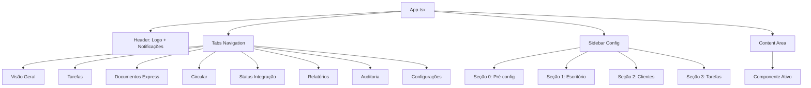

\newpage

# Sumário Executivo

O **Domínio Processos** é um sistema completo de gestão de tarefas, documentos e fluxos de trabalho desenvolvido especificamente para escritórios contábeis. Este documento consolida tanto as funcionalidades já implementadas quanto o roadmap estratégico para os próximos 12 meses.

**Situação Atual (Abril 2026):**
- ✅ **7 módulos funcionais** totalmente implementados
- ✅ **20+ componentes de gestão** operacionais
- ✅ **Interface React moderna** com ~15.700 linhas de código
- 🚧 **35 requisitos funcionais** mapeados para evolução

**Objetivo do Produto:**
Eliminar retrabalho causado por falta de integração entre sistemas, reduzir parametrizações manuais repetitivas e automatizar o envio e rastreamento de documentos para clientes.

**Público-Alvo:**
- Contadores e colaboradores operacionais
- Gestores de escritórios contábeis
- Clientes dos escritórios (empresas atendidas)

**Principais Diferenciais:**
1. Interface unificada para tarefas, documentos e comunicações
2. Automação de processos repetitivos
3. Integração nativa com Messenger e Portal do Cliente
4. Templates pré-configurados por tipo de escritório
5. Rastreamento completo de documentos enviados

---

\newpage

# 1. Visão Geral do Produto

## 1.1 Contexto e Problema

Escritórios contábeis enfrentam desafios operacionais que impactam diretamente sua produtividade e a experiência de seus clientes:

### Problemas Identificados

**P1 - Retrabalho Excessivo**
- Cadastros duplicados entre sistemas diferentes (ERP, Messenger, Portal)
- Parametrizações manuais repetitivas para cada cliente
- Falta de sincronização entre módulos

**P2 - Baixa Produtividade**
- Excesso de cliques para tarefas simples (média de 7-10 cliques por tarefa)
- Processos manuais que poderiam ser automatizados
- Dificuldade de acompanhar status de múltiplas tarefas

**P3 - Falta de Rastreamento**
- Impossibilidade de saber se cliente recebeu/visualizou documentos
- Ausência de alertas para tarefas não geradas ou atrasadas
- Dificuldade de auditoria de ações realizadas

**P4 - Resistência à Adoção**
- Curva de aprendizado alta para novos usuários
- Falta de treinamento contextual
- Abandono por falta de suporte proativo

### Impacto nos Negócios

- ⏱️ **Tempo perdido:** 30-40% do tempo em tarefas manuais evitáveis
- 💸 **Custos elevados:** Retrabalho aumenta custos operacionais em ~25%
- 😞 **Insatisfação:** Clientes reclamam de atrasos e falta de transparência
- 📉 **Churn:** ~15-20% dos clientes abandonam nos primeiros 3 meses

## 1.2 Solução Proposta

O **Domínio Processos** oferece uma plataforma integrada que:

1. **Centraliza** todas as operações de gestão de processos contábeis
2. **Automatiza** tarefas recorrentes e parametrizações
3. **Integra** nativamente com Messenger e Portal do Cliente
4. **Rastreia** todos os documentos e comunicações
5. **Acelera** onboarding com templates pré-configurados

### Benefícios Esperados

| Métrica | Objetivo | Prazo |
|---------|----------|-------|
| Redução de cadastros duplicados | 80% | 6 meses |
| Redução de cliques por tarefa | 60% (de 10 para 4 cliques) | 3 meses |
| Taxa de adoção 30 dias pós-onboarding | 85% | 6 meses |
| Tempo médio de resposta a falhas | < 1 hora | 3 meses |
| Taxa de conclusão de onboarding gamificado | 70% | 6 meses |

---

\newpage

# 2. Personas e Casos de Uso

## 2.1 Personas Principais

### Persona 1: Contador/Colaborador Operacional

**Nome:** Maria Silva  
**Idade:** 28 anos  
**Cargo:** Analista Contábil  
**Experiência:** 5 anos em escritório contábil

**Perfil:**
- Executa tarefas diárias de fechamento, envio de documentos e comunicação com clientes
- Gerencia carteira de 40-60 empresas
- Trabalha sob pressão de prazos fiscais e obrigações acessórias

**Necessidades:**
- Agilidade para concluir tarefas repetitivas
- Visibilidade clara de pendências e prazos
- Confirmação de que documentos foram entregues aos clientes
- Menos cliques e etapas para operações comuns

**Frustrações:**
- Cadastrar mesma informação em múltiplos sistemas
- Não saber se cliente recebeu/visualizou documento
- Perder tempo procurando tarefas atrasadas
- Sistema lento ou confuso

**Como o produto ajuda:**
- ✅ Conclusão de tarefas em até 3 cliques
- ✅ Dashboard com visão consolidada de pendências
- ✅ Rastreamento de documentos enviados
- ✅ Cadastro único sincronizado entre módulos

---

### Persona 2: Gestor do Escritório

**Nome:** João Oliveira  
**Idade:** 42 anos  
**Cargo:** Sócio-Diretor  
**Experiência:** 18 anos no setor contábil

**Perfil:**
- Supervisiona equipe de 8-12 colaboradores
- Define processos e configurações do escritório
- Monitora produtividade e qualidade do serviço
- Busca otimização e escalabilidade

**Necessidades:**
- Visão macro de produtividade da equipe
- Relatórios para tomada de decisão
- Configurações flexíveis por departamento/cliente
- Alertas de anomalias (tarefas não geradas, falhas)

**Frustrações:**
- Falta de visibilidade sobre gargalos
- Descobrir problemas tarde demais
- Dificuldade de padronizar processos entre colaboradores
- Relatórios complexos de extrair

**Como o produto ajuda:**
- ✅ Dashboards customizáveis por departamento/funcionário
- ✅ Alertas automáticos de tarefas pendentes e falhas
- ✅ Templates padronizados para toda equipe
- ✅ Exportação de relatórios em Excel/PDF

---

### Persona 3: Novo Cliente (Onboarding)

**Nome:** Escritório Contábil ABC  
**Tamanho:** 15 colaboradores  
**Situação:** Acabou de contratar o sistema

**Perfil:**
- Migrando de sistema concorrente ou planilhas
- Precisa configurar rapidamente para não parar operação
- Equipe com níveis variados de familiaridade com tecnologia
- Ansioso para ver resultados rápidos

**Necessidades:**
- Setup rápido e descomplicado
- Templates prontos para seu tipo de escritório
- Treinamento prático e acessível
- Suporte próximo nos primeiros dias

**Frustrações:**
- Configuração manual demorada
- Não saber por onde começar
- Equipe resistente a mudanças
- Falta de suporte quando trava

**Como o produto ajuda:**
- ✅ Pacotes pré-configurados por perfil de escritório
- ✅ Onboarding gamificado com marcos claros
- ✅ Tutoriais contextuais na primeira vez
- ✅ Suporte proativo para clientes inativos >7 dias

---

### Persona 4: Cliente do Escritório

**Nome:** Empresa XYZ Ltda  
**Segmento:** Comércio varejista  
**Relacionamento:** Cliente há 2 anos

**Perfil:**
- Recebe documentos e comunicações do escritório contábil
- Acessa Portal do Cliente esporadicamente
- Prefere receber por WhatsApp ou email
- Pouco tempo para acessar múltiplas plataformas

**Necessidades:**
- Receber documentos no canal preferido (email/WhatsApp/Portal)
- Organização clara dos documentos recebidos
- Facilidade de encontrar documentos antigos

**Frustrações:**
- Receber muitos emails separados
- Documentos desorganizados
- Precisar logar em sistema só para baixar um documento

**Como o produto ajuda:**
- ✅ Preferências de canal por cliente
- ✅ Agrupamento de múltiplos documentos em um envio
- ✅ Organização automática por CNPJ/competência/tipo
- ✅ Acesso direto via WhatsApp sem obrigatoriedade de cadastro

---

\newpage

# 3. Arquitetura do Sistema - Estado Atual

## 3.1 Visão Geral da Arquitetura

O sistema atual está implementado como uma **Single Page Application (SPA)** em React com navegação por abas/tabs e painel lateral de configurações.

### Estrutura de Navegação

```
┌─────────────────────────────────────────────────────────┐
│  Header: Logo + Notificações + Perfil                  │
├─────────────────────────────────────────────────────────┤
│  Tabs: [Visão Geral] [Tarefas] [Docs] [...] [Config]  │
├───────────┬─────────────────────────────────────────────┤
│  Sidebar  │  Conteúdo Principal (Tab Ativa)            │
│  (Config) │                                             │
│           │                                             │
│  - Pré-   │                                             │
│    config │                                             │
│  - Escrit.│                                             │
│  - Client.│                                             │
│  - Tarefas│                                             │
└───────────┴─────────────────────────────────────────────┘
```

### Módulos Principais (Tabs)

1. **Visão Geral** - Dashboard com KPIs e métricas
2. **Tarefas** - Gestão Kanban de tarefas
3. **Documentos Express** - Envio e gestão de documentos
4. **Circular** - Comunicações circulares
5. **Status de Integração** - Monitoramento de integrações
6. **Relatórios** - Geração de relatórios e listas
7. **Auditoria** - Rastreamento de ações
8. **Configurações** - Painel de configurações (sidebar)

### Seções de Configuração (Sidebar)

**Seção 0: Pré-configurações**
- Funcionários do Escritório
- Empresas
- Usuários do Cliente

**Seção 1: Escritório**
- Feriados e Horários
- Responsabilidades

**Seção 2: Clientes**
- Agrupador de Tarefas por Cliente
- Adequação de Agrupadores
- Inbox Config
- Personalizar Assinatura
- Templates Email/WhatsApp

**Seção 3: Tarefas**
- Modelos de Documento
- Gerenciar Tarefas
- Gerador de Tarefas
- Listas Detalhadas

---

## 3.2 Stack Tecnológico Atual

### Frontend

| Tecnologia | Versão | Propósito |
|------------|--------|-----------|
| **React** | 18.3.1 | Framework UI principal |
| **TypeScript** | Latest | Type safety |
| **Vite** | 6.3.5 | Build tool e dev server |
| **TailwindCSS** | 4.1.12 | Utility-first CSS framework |
| **Material-UI** | 7.3.5 | Componentes UI (primários) |
| **Radix UI** | Latest | Componentes UI headless (acessibilidade) |
| **React Router** | 7.13.0 | Navegação (futura multi-page) |
| **React Hook Form** | 7.55.0 | Gerenciamento de formulários |
| **date-fns** | 3.6.0 | Manipulação de datas |
| **Recharts** | 2.15.2 | Gráficos e visualizações |
| **Lucide React** | 0.487.0 | Ícones |

### Bibliotecas de Componentes UI

- **@radix-ui/react-*** - 20+ componentes primitivos (accordion, dialog, dropdown, etc.)
- **react-dnd** - Drag and drop (Kanban)
- **sonner** - Toast notifications
- **vaul** - Drawer component
- **cmdk** - Command palette

### Build e Desenvolvimento

- **PostCSS** - Processamento CSS
- **@vitejs/plugin-react** - Plugin React para Vite
- **@tailwindcss/vite** - Plugin TailwindCSS para Vite

### Backend (Não Implementado)

O frontend atual **NÃO possui backend**. É um protótipo exportado do Figma com:
- ❌ Dados mockados/hardcoded
- ❌ Sem persistência
- ❌ Sem APIs REST
- ❌ Sem autenticação

> **Roadmap:** Backend será necessário para implementar os RFs de integração, automação e persistência de dados.

---

\newpage

# 4. Módulos Funcionais - Detalhamento

## 4.1 Visão Geral & Dashboard

### 📊 Status: ✅ Implementado (Frontend) | 🚧 Roadmap (Backend + Features)

### Componentes

- **VisaoGeral.tsx** (linha 630) - Componente principal
  - `KpiCard` - Cards de métricas
  - `TaskListDrawer` - Drawer de listagem de tarefas
  - `FalhaEnvioDrawer` - Drawer de falhas de envio
  - `ConfigPendentesDrawer` - Drawer de configurações pendentes
  - `StatusBadge` - Badge de status de tarefas
  - `ProgressBar` - Barra de progresso
  - `Avatar` - Avatar de usuários

### Funcionalidades Implementadas

**F1 - Cards de KPI**
- Total de tarefas
- Tarefas em andamento
- Tarefas concluídas
- Tarefas atrasadas
- Falhas de envio
- Configurações pendentes
- Cada card exibe:
  - Valor numérico
  - Ícone colorido
  - Subtexto com detalhes
  - Ação de clique para drill-down

**F2 - Drawers de Detalhamento**
- Clicking em KPI card abre drawer lateral com:
  - Lista paginada de itens
  - Filtros básicos
  - Ações em lote (selecionar múltiplos)
  - Informações detalhadas por item

**F3 - Listagem de Tarefas com Status**
- Visualização de tarefas por status:
  - ⏳ Aguardando inicio
  - 🔄 Em andamento
  - ✅ Concluídas
  - ⚠️ Atrasadas
- Badges coloridos para identificação visual
- Avatar dos responsáveis
- Progresso percentual

**F4 - Alertas de Falhas e Pendências**
- Card destacado para falhas de envio
- Card para configurações pendentes
- Click abre drawer com detalhes e ações corretivas

### Roadmap - Funcionalidades Planejadas

**RF-16: Dashboards Personalizáveis**
- [ ] Permitir usuário customizar quais KPIs exibir
- [ ] Drag-and-drop para reordenar cards
- [ ] Filtros por período (hoje, semana, mês, customizado)
- [ ] Filtros por responsável/departamento/cliente
- [ ] Salvar configurações de dashboard por usuário
- [ ] Templates de dashboard por perfil (contador, gestor, etc.)

**RF-17: Exportação de Relatórios**
- [ ] Exportar dados do dashboard para Excel
- [ ] Exportar dados do dashboard para PDF
- [ ] Incluir gráficos nas exportações
- [ ] Agendamento de envio automático de relatórios
- [ ] Performance: gerar arquivo em <30s para até 10.000 registros

**RF-28: Alertas Inteligentes**
- [ ] Alertar gestor quando tarefas recorrentes não forem geradas no prazo
- [ ] Notificação em até 1 hora após falha de envio não resolvida
- [ ] Configuração de canais de alerta (email, push, WhatsApp)

### Critérios de Aceite

**Dashboard Personalizável (RF-16):**
- ✅ Usuário consegue ocultar/exibir cards de KPI
- ✅ Filtros incluem: período, responsável, cliente, status
- ✅ Configuração é salva e restaurada entre sessões
- ✅ Tempo de carregamento <2s para dashboard com 6 KPIs

**Exportação (RF-17):**
- ✅ Botão "Exportar" visível em todos os relatórios
- ✅ Formatos: Excel (.xlsx) e PDF
- ✅ Exportação preserva filtros aplicados
- ✅ Arquivo gerado em <30s para 10.000 registros

**Alertas (RF-28):**
- ✅ Alerta enviado em <1h após detecção de falha
- ✅ Configuração permite escolher quais eventos geram alerta
- ✅ Múltiplos canais configuráveis por tipo de alerta

---

## 4.2 Gestão de Tarefas

### 📋 Status: ✅ Implementado (Frontend Kanban) | 🚧 Roadmap (Automação + Integrações)

### Componentes

- **Tarefas.tsx** (linha 238) - Board Kanban principal
  - `buildTarefa` - Factory de tarefas
  - `StatusBadge` - Badge de status
- **GeradorTarefas.tsx** - Geração de tarefas recorrentes
- **GerenciarTarefas.tsx** - CRUD de tarefas e fluxos
- **ListasDetalhadas.tsx** - Listas e visualizações alternativas

### Funcionalidades Implementadas

**F1 - Board Kanban**
- Visualização de tarefas em colunas por status:
  - 📝 A fazer
  - 🔄 Em andamento
  - ✅ Concluídas
- Drag-and-drop para mover tarefas entre colunas
- Cards de tarefa exibem:
  - Título
  - Cliente/empresa
  - Responsável (avatar)
  - Data de vencimento
  - Tags/labels
  - Prioridade

**F2 - Gerador de Tarefas Recorrentes**
- Criação de templates de tarefas que se repetem
- Configuração de:
  - Frequência (diária, semanal, mensal, anual)
  - Dia do mês / dia da semana
  - Responsável padrão
  - Checklist de subtarefas
  - Documentos associados

**F3 - Gerenciamento de Tarefas**
- CRUD completo de tarefas individuais
- Atribuição de responsáveis
- Definição de prazos
- Anexo de documentos
- Histórico de mudanças (auditoria)

**F4 - Listas Detalhadas**
- Visualização tabular (alternativa ao Kanban)
- Ordenação por colunas
- Filtros múltiplos
- Paginação

### Roadmap - Funcionalidades Planejadas

**RF-03: Conversão de Messenger para Tarefa**
- [ ] Integração com módulo Messenger
- [ ] Botão "Criar Tarefa" em conversas
- [ ] Auto-preencher dados do cliente da conversa
- [ ] Anexar histórico da conversa à tarefa
- [ ] Notificar usuário que tarefa foi criada

**RF-11: Reduzir Cliques para Concluir Tarefa**
- [ ] Meta: concluir tarefa simples em máximo 3 cliques
- [ ] Ações rápidas no card do Kanban (botões inline)
- [ ] Conclusão em lote via seleção múltipla
- [ ] Atalhos de teclado (ex: Ctrl+Enter para concluir)

**RF-12: Conclusão em Lote**
- [ ] Checkbox em cada card de tarefa
- [ ] Botão "Concluir Selecionadas" (ação em lote)
- [ ] Confirmação única para múltiplas tarefas
- [ ] Indicador visual de quantas tarefas estão selecionadas

**RF-13: Edição e Exclusão em Lote**
- [ ] Editar múltiplas tarefas simultaneamente
- [ ] Campos editáveis em lote: responsável, prazo, tags, prioridade
- [ ] Excluir múltiplas tarefas com confirmação
- [ ] Desfazer ação em lote (undo)

**RF-14: Download em Lote**
- [ ] Selecionar múltiplas tarefas
- [ ] Baixar todos os documentos anexados em ZIP
- [ ] Preservar estrutura de pastas no ZIP
- [ ] Exportar dados das tarefas para Excel

**RF-15: Aprovadores em Lote**
- [ ] Definir aprovador para múltiplas tarefas
- [ ] Fluxo de aprovação (submeter → aprovar/rejeitar)
- [ ] Notificação ao aprovador
- [ ] Histórico de aprovações

**RF-27: Automação de Tarefas Recorrentes**
- [ ] Tarefas geradas automaticamente com base em eventos do sistema principal
- [ ] Exemplos de gatilhos:
  - Fechamento de folha de pagamento → gera tarefa "Enviar contracheques"
  - Emissão de guia → gera tarefa "Conferir e enviar guia ao cliente"
  - Vencimento de obrigação → gera tarefa "Preparar declaração X"
- [ ] Configuração de regras no Gerador de Tarefas
- [ ] Logs de tarefas auto-geradas

**RF-29: Tarefas Avulsas (Sem Cliente)**
- [ ] Permitir criar tarefas não vinculadas a cliente específico
- [ ] Exemplos: "Atualizar software", "Reunião interna", "Treinamento"
- [ ] Campo "Cliente" opcional
- [ ] Filtro para exibir/ocultar tarefas avulsas

**RF-30: Integração com Google Calendar**
- [ ] Sincronização bidirecional com Google Calendar
- [ ] Tarefas com prazo aparecem como eventos no calendário
- [ ] Editar data/hora no Google Calendar atualiza tarefa
- [ ] Notificações do Google Calendar para prazos

### Critérios de Aceite

**Redução de Cliques (RF-11):**
- ✅ Concluir tarefa simples: máximo 3 cliques
- ✅ Fluxo: (1) Abrir tarefa → (2) Marcar concluída → (3) Confirmar
- ✅ Atalho de teclado disponível e documentado

**Conclusão em Lote (RF-12):**
- ✅ Usuário seleciona N tarefas via checkbox
- ✅ Botão "Concluir Selecionadas" visível quando N > 0
- ✅ Confirmação única com contagem (ex: "Concluir 5 tarefas?")
- ✅ Todas as tarefas mudam de status simultaneamente

**Edição em Lote (RF-13):**
- ✅ Formulário de edição em lote suporta: responsável, prazo, tags
- ✅ Alterações aplicadas a todas as tarefas selecionadas
- ✅ Histórico de auditoria registra "edição em lote por [usuário]"

**Automação (RF-27):**
- ✅ Tarefa recorrente gerada automaticamente no momento do evento
- ✅ Nenhuma intervenção humana necessária
- ✅ Log de execução disponível para auditoria

**Integração Google Calendar (RF-30):**
- ✅ Sincronização ocorre em tempo real (<5s de delay)
- ✅ Edição no Google Calendar reflete na tarefa
- ✅ Notificações do Google aparecem nos horários configurados

---

## 4.3 Documentos Express

### 📄 Status: ✅ Implementado (UI de Envio) | 🚧 Roadmap (Envio em Lote + Rastreamento)

### Componentes

- **DocumentosExpress.tsx** - Interface de envio de documentos
- **ModelosDocumento.tsx** - Gerenciamento de templates de documentos

### Funcionalidades Implementadas

**F1 - Interface de Envio**
- Formulário para envio de documentos
- Seleção de clientes destinatários
- Upload de arquivos (múltiplos)
- Seleção de canal de envio (email, WhatsApp, Portal)
- Pré-visualização de documentos

**F2 - Modelos de Documento**
- Cadastro de templates de documentos
- Categorização por tipo (contracheque, guia, declaração, etc.)
- Configuração de nome padrão do arquivo
- Associação com tipo de tarefa

### Roadmap - Funcionalidades Planejadas

**RF-18: Envio em Lote Agrupado**
- [ ] Selecionar múltiplos clientes
- [ ] Selecionar múltiplos documentos
- [ ] Agrupar documentos por:
  - Empresa (todos os documentos de uma empresa em um único email)
  - Período/competência (ex: todos os documentos de março/2026)
  - Tipo de documento (ex: todas as guias juntas)
- [ ] Enviar em um único email ou mensagem WhatsApp
- [ ] Pré-visualização do agrupamento antes de enviar

**RF-19: Preferências de Envio por Cliente**
- [ ] Configurar canal preferencial por cliente:
  - Email
  - WhatsApp
  - Portal do Cliente
  - Múltiplos canais simultaneamente
- [ ] Configurar periodicidade:
  - Envio imediato (assim que documento é gerado)
  - Envio em lote (escolher dia e hora da semana)
- [ ] Sistema respeita preferência em 100% dos envios automáticos

**RF-20: Envio via WhatsApp sem Cadastro no Portal**
- [ ] Integração com WhatsApp Business API
- [ ] Enviar documento via WhatsApp sem exigir cadastro no Portal
- [ ] Cliente recebe link temporário para download
- [ ] Link expira após N dias (configurável)

**RF-21: Organização Automática de Documentos**
- [ ] Sistema organiza documentos enviados automaticamente em pastas
- [ ] Estrutura de pastas:
  ```
  CNPJ_RazaoSocial/
    └── Setor/
        └── Ano/
            └── Mês/
                └── documentos.pdf
  ```
- [ ] Exemplo:
  ```
  12345678000190_Empresa_XYZ/
    └── Contabil/
        └── 2026/
            └── Marco/
                ├── balancete.pdf
                └── DRE.pdf
  ```
- [ ] Criação automática sem intervenção manual

**RF-22: Rastreamento de Documentos**
- [ ] Registrar data/hora de abertura do documento pelo cliente
- [ ] Registrar data/hora de download
- [ ] Registrar quantas vezes foi visualizado
- [ ] Dashboard de rastreamento:
  - Quais clientes não abriram documentos
  - Quais documentos foram mais acessados
  - Tempo médio até primeira visualização
- [ ] Alertas para documentos não visualizados após N dias

### Critérios de Aceite

**Envio em Lote (RF-18):**
- ✅ Usuário seleciona N clientes com checkbox
- ✅ Seleciona M documentos
- ✅ Sistema agrupa em uma única operação
- ✅ Confirmação exibe resumo: "Enviar 10 documentos para 5 clientes"
- ✅ Envio executado em background com barra de progresso

**Preferências (RF-19):**
- ✅ Cadastro de cliente tem seção "Preferências de Envio"
- ✅ Opções: Email / WhatsApp / Portal / Múltiplos
- ✅ Periodicidade: Imediato / Lote (dia/hora da semana)
- ✅ Sistema respeita preferência em envios automáticos

**Rastreamento (RF-22):**
- ✅ Registro de eventos: enviado / aberto / baixado
- ✅ Timestamp preciso de cada evento
- ✅ Dashboard exibe status por destinatário
- ✅ Relatório de documentos não visualizados

---

## 4.4 Circular

### 📢 Status: ✅ Implementado (UI Básica) | 🚧 Roadmap (Comunicação em Massa)

### Componentes

- **Circular.tsx** - Interface de criação e envio de comunicados circulares

### Funcionalidades Implementadas

**F1 - Criação de Circulares**
- Editor de texto para redigir comunicado
- Seleção de destinatários (clientes)
- Definição de assunto
- Anexos de documentos

**F2 - Histórico de Circulares**
- Listagem de circulares enviadas
- Filtro por período
- Visualização de destinatários por circular

### Roadmap - Funcionalidades Planejadas

**RF-23: Personalização de Templates**
- [ ] Editor visual de templates de circular
- [ ] Upload de logomarca do escritório
- [ ] Campos dinâmicos:
  - `{{nome_cliente}}`
  - `{{competencia}}`
  - `{{tipo_documento}}`
  - `{{data_vencimento}}`
- [ ] Pré-visualização antes de enviar

**RF-24: Múltiplos Modelos de Mensagem**
- [ ] Salvar até 10+ modelos diferentes
- [ ] Categorização por tipo:
  - Envio de documentos
  - Lembretes de vencimento
  - Avisos gerais
  - Comunicados fiscais
- [ ] Seleção rápida de template ao criar circular

**RF-25: Preferências por Cliente**
- [ ] Respeitar canal preferencial (email/WhatsApp/Portal)
- [ ] Respeitar periodicidade configurada
- [ ] Opção de override manual para comunicados urgentes

### Critérios de Aceite

**Templates (RF-23):**
- ✅ Editor suporta formatação (negrito, itálico, listas)
- ✅ Upload de logo em PNG/JPG (máx 500KB)
- ✅ Campos dinâmicos substituídos corretamente no envio
- ✅ Pré-visualização renderiza template com dados reais de exemplo

**Modelos (RF-24):**
- ✅ Usuário pode salvar mínimo 10 modelos
- ✅ Nome e descrição para identificar modelo
- ✅ Seleção via dropdown ao criar circular

---

## 4.5 Status de Integração

### 🔗 Status: ✅ Implementado (UI de Monitoramento) | 🚧 Roadmap (Integrações Reais)

### Componentes

- **StatusIntegracao.tsx** - Dashboard de status de integrações com sistemas externos

### Funcionalidades Implementadas

**F1 - Monitoramento de Status**
- Cards de status para cada integração:
  - ✅ Conectado
  - ⚠️ Falha parcial
  - ❌ Desconectado
- Última sincronização (timestamp)
- Botão para forçar nova sincronização

**F2 - Logs de Integração**
- Histórico de tentativas de sincronização
- Mensagens de erro detalhadas
- Tempo de execução

### Roadmap - Funcionalidades Planejadas

**RF-01: Auto-Criação de Tarefas via Portal do Cliente**
- [ ] Ao publicar documento no Portal, criar tarefa no Processos automaticamente
- [ ] Tarefa criada com status "Concluída" (documento já foi enviado)
- [ ] Vincular documento à tarefa
- [ ] Registrar em auditoria

**RF-02: Sincronização com Messenger**
- [ ] Sincronizar envios de documentos entre Processos e Messenger
- [ ] Evitar cadastros duplicados
- [ ] Ao enviar documento no Processos, registrar no Messenger
- [ ] Vice-versa: envio no Messenger cria registro no Processos

**RF-04: Cadastro Único de Cliente/Empresa**
- [ ] Cadastro unificado sincronizado entre:
  - Domínio Processos
  - Messenger
  - Portal do Cliente
- [ ] Alteração em um módulo reflete nos outros em tempo real
- [ ] Campos sincronizados:
  - Razão social
  - CNPJ
  - Email(s)
  - Telefone(s)
  - Endereço
  - Responsáveis

**RF-05: Importação de Cadastros**
- [ ] Importar via planilha Excel
- [ ] Campos mínimos obrigatórios: Razão Social, CNPJ, Email, Telefone
- [ ] Validação de CNPJ
- [ ] Relatório de erros linha a linha
- [ ] Importação de sistemas concorrentes (mapeamento customizado)

### Critérios de Aceite

**Auto-Criação de Tarefas (RF-01):**
- ✅ Publicação no Portal cria tarefa automaticamente
- ✅ Tarefa criada já vem com status "Concluída"
- ✅ Documento anexado à tarefa
- ✅ Processo ocorre em <5s

**Sincronização Messenger (RF-02):**
- ✅ Envio no Processos aparece no Messenger em <5s
- ✅ Nenhum cadastro duplicado gerado
- ✅ Sincronização bidirecional funciona

**Cadastro Único (RF-04):**
- ✅ Cliente cadastrado no Processos aparece no Messenger e Portal sem novo cadastro
- ✅ Alteração de dados sincroniza entre módulos em <5s
- ✅ Conflitos de dados (edição simultânea) são detectados e resolvidos

**Importação (RF-05):**
- ✅ Upload de .xlsx ou .csv
- ✅ Validação de CNPJ e email
- ✅ Relatório de erros exibe linha e campo com problema
- ✅ Importação bem-sucedida cria cadastros em todos os módulos

---

## 4.6 Relatórios

### 📊 Status: ✅ Implementado (Listagens Básicas) | 🚧 Roadmap (Exportação + Personalização)

### Componentes

- **Relatorios.tsx** - Interface de geração de relatórios
- **ListasDetalhadas.tsx** - Listagens tabulares detalhadas

### Funcionalidades Implementadas

**F1 - Relatórios Pré-Configurados**
- Tarefas por status
- Tarefas por responsável
- Tarefas por cliente
- Documentos enviados por período
- Falhas de envio

**F2 - Filtros Básicos**
- Período (data início/fim)
- Responsável
- Cliente
- Status

**F3 - Visualização Tabular**
- Ordenação por colunas
- Paginação
- Busca textual

### Roadmap - Funcionalidades Planejadas

**RF-16: Dashboards e Relatórios Personalizáveis**
- [ ] Permitir usuário criar relatórios customizados
- [ ] Seleção de campos a exibir
- [ ] Múltiplos filtros simultâneos:
  - Período
  - Responsável
  - Departamento
  - Cliente
  - Status
  - Tipo de tarefa/documento
  - Tags
- [ ] Salvar configuração de relatório
- [ ] Compartilhar relatório com outros usuários

**RF-17: Exportação de Relatórios**
- [ ] Exportar para Excel (.xlsx)
- [ ] Exportar para PDF
- [ ] Incluir gráficos na exportação
- [ ] Performance: <30s para 10.000 registros
- [ ] Manter formatação e filtros aplicados
- [ ] Agendamento de envio automático por email

### Critérios de Aceite

**Personalização (RF-16):**
- ✅ Interface de criação de relatório customizado
- ✅ Seleção de campos via drag-and-drop ou checkboxes
- ✅ Múltiplos filtros aplicáveis simultaneamente
- ✅ Salvar relatório com nome descritivo
- ✅ Compartilhar via link ou email

**Exportação (RF-17):**
- ✅ Botão "Exportar" presente em todos os relatórios
- ✅ Opções: Excel / PDF
- ✅ Arquivo gerado em <30s para 10.000 registros
- ✅ Gráficos renderizados corretamente no arquivo
- ✅ Agendamento permite configurar: dia da semana, hora, destinatários

---

## 4.7 Auditoria

### 🔍 Status: ✅ Implementado (Logs Básicos) | 🚧 Roadmap (Auditoria Avançada)

### Componentes

- **Auditoria.tsx** - Interface de visualização de logs de auditoria

### Funcionalidades Implementadas

**F1 - Registro de Ações**
- Log de todas as ações realizadas no sistema:
  - Criação/edição/exclusão de tarefas
  - Envio de documentos
  - Alteração de configurações
  - Login/logout
- Informações registradas:
  - Usuário
  - Data/hora
  - Tipo de ação
  - Entidade afetada
  - Valores antigos e novos (para edições)

**F2 - Busca de Logs**
- Filtro por período
- Filtro por usuário
- Filtro por tipo de ação
- Busca textual

**F3 - Detalhamento de Auditoria**
- Click em log abre detalhes completos
- Diff de valores (antes vs depois)
- Rastreamento de quem fez quê

### Roadmap - Funcionalidades Planejadas

**RF-31: Notificações e Alertas**
- [ ] Enviar notificações automáticas sobre:
  - Tarefas pendentes há mais de N dias
  - Falhas de envio não resolvidas
  - Documentos não visualizados por cliente após N dias
  - Configurações obrigatórias não preenchidas
- [ ] Configuração de canais de notificação:
  - Email
  - Push notification (navegador/app)
  - WhatsApp
- [ ] Configuração granular: quais eventos geram alerta

**RF-32: Alertas Personalizados**
- [ ] Usuário pode criar regras customizadas de alerta
- [ ] Exemplo de regra:
  - SE tarefa do tipo "Emissão de guia" não for concluída até 2 dias antes do vencimento
  - ENTÃO enviar email para gestor
- [ ] Múltiplas condições (AND/OR)
- [ ] Múltiplas ações (enviar email + criar tarefa de follow-up)

### Critérios de Aceite

**Notificações (RF-31):**
- ✅ Alerta enviado <1h após detecção de evento
- ✅ Configuração permite habilitar/desabilitar cada tipo de alerta
- ✅ Múltiplos canais configuráveis (email + push + WhatsApp)
- ✅ Histórico de alertas enviados visível em auditoria

**Alertas Customizados (RF-32):**
- ✅ Interface de criação de regra de alerta
- ✅ Suporte a condições: tipo de tarefa, status, prazo, responsável, cliente
- ✅ Suporte a ações: email, push, WhatsApp, criar tarefa
- ✅ Testabilidade: botão "Testar Regra" simula execução

---

\newpage

# 5. Configurações e Administração

## 5.1 Configurações de Escritório

### 🏢 Status: ✅ Implementado (CRUD Básico) | 🚧 Roadmap (Templates + Assistência)

### Componentes

**FuncionariosEscritorio.tsx**
- Cadastro de funcionários do escritório
- Definição de permissões/perfis
- Vinculação a departamentos

**FeriadosHorarios.tsx**
- Cadastro de feriados nacionais/estaduais/municipais
- Configuração de horário de funcionamento
- Definição de dias úteis customizados

**Responsabilidades.tsx**
- Atribuição de responsabilidades por tipo de tarefa
- Matriz de competências (quem pode fazer o quê)
- Fluxos de aprovação

### Funcionalidades Implementadas

**F1 - Gestão de Funcionários**
- CRUD de funcionários
- Campos: nome, email, telefone, cargo, departamento
- Definição de permissões:
  - Admin
  - Gestor
  - Contador/Operacional
  - Somente leitura

**F2 - Calendário de Feriados**
- Importação de feriados nacionais (API externa)
- Cadastro manual de feriados estaduais/municipais
- Definição de pontos facultativos
- Impacto no cálculo de prazos de tarefas

**F3 - Matriz de Responsabilidades**
- Configuração de quem é responsável padrão por tipo de tarefa
- Exemplo:
  - "Envio de contracheque" → Departamento Pessoal
  - "Apuração de impostos" → Departamento Fiscal
  - "Fechamento contábil" → Departamento Contábil
- Permite override por cliente específico

### Roadmap - Funcionalidades Planejadas

**RF-06: Templates de Fluxos por Tipo de Escritório**
- [ ] Pacotes pré-configurados disponíveis imediatamente após contratação
- [ ] Perfis de escritório:
  - Contábil + Fiscal
  - Contábil + DP
  - Contábil + Fiscal + DP
  - Contábil puro
  - Consultoria tributária
- [ ] Cada perfil inclui:
  - Tipos de tarefas comuns
  - Fluxos pré-configurados
  - Templates de documentos
  - Responsabilidades padrão
  - Feriados nacionais + calendário fiscal

**RF-07: Pacotes de Tarefas Recorrentes Prontos**
- [ ] Pacotes editáveis antes de ativar
- [ ] Exemplos de pacotes:
  - "Obrigações mensais - Simples Nacional"
  - "Obrigações mensais - Lucro Presumido"
  - "Folha de Pagamento - mensal"
  - "Declarações anuais - PJ"
- [ ] Cada pacote contém:
  - 10-30 tarefas recorrentes
  - Prazos pré-configurados
  - Checklists de subtarefas
  - Documentos associados

**RF-10: Implementação Assistida (Serviço Profissional)**
- [ ] Oferecer como serviço opcional pago
- [ ] Time de implantação executa:
  - Importação de cadastros do sistema anterior
  - Configuração de fluxos customizados
  - Parametrização de permissões
  - Treinamento da equipe (presencial ou remoto)
  - Acompanhamento nos primeiros 30 dias
- [ ] Entrega: sistema 100% pronto para uso
- [ ] Prazo: 5-15 dias úteis dependendo do porte

### Critérios de Aceite

**Templates por Tipo (RF-06):**
- ✅ Na tela de onboarding, usuário seleciona tipo de escritório
- ✅ Pacote de tarefas carregado automaticamente em <10s
- ✅ Pacote inclui mínimo 20 tarefas recorrentes
- ✅ Calendário de feriados nacionais já configurado

**Pacotes Editáveis (RF-07):**
- ✅ Antes de ativar, usuário pode editar qualquer tarefa do pacote
- ✅ Pode adicionar/remover tarefas do pacote
- ✅ Pode alterar prazos, responsáveis, checklists
- ✅ Ativação aplica todas as tarefas ao sistema

**Implementação Assistida (RF-10):**
- ✅ Opção de contratação disponível no onboarding
- ✅ Prazo de entrega informado claramente
- ✅ Checklist de entregáveis visível ao cliente
- ✅ Sistema entregue 100% configurado

---

## 5.2 Gestão de Clientes

### 👥 Status: ✅ Implementado (CRUD Completo) | 🚧 Roadmap (Importação + Cadastro Flexível)

### Componentes

**Empresas.tsx**
- Cadastro de empresas clientes
- Dados cadastrais completos
- Configurações específicas por empresa

**UsuariosCliente.tsx**
- Cadastro de usuários/contatos das empresas clientes
- Vinculação usuário-empresa
- Permissões de acesso (quem pode ver o quê)

**AgrupadorTarefasClientes.tsx**
- Definição de agrupamentos de clientes
- Exemplos de agrupadores:
  - Por porte (MEI, Simples, Lucro Presumido, Lucro Real)
  - Por regime tributário
  - Por segmento de atuação
  - Por responsável no escritório
- Aplicação de regras em lote por agrupador

**AdequacaoAgrupadores.tsx**
- Adequação de configurações de agrupadores
- Migração de clientes entre agrupadores
- Aplicação retroativa de regras

### Funcionalidades Implementadas

**F1 - Cadastro de Empresas**
- CRUD completo
- Campos obrigatórios: Razão Social, CNPJ, Email
- Campos opcionais: Telefone, endereço, regime tributário, etc.
- Upload de documentos (contrato social, etc.)

**F2 - Gestão de Usuários/Contatos**
- Múltiplos contatos por empresa
- Categorização (sócio, contador interno, responsável financeiro, etc.)
- Preferências de comunicação por contato

**F3 - Agrupadores**
- Criação de grupos customizados
- Atribuição de clientes a grupos
- Configuração de regras padrão por grupo:
  - Tarefas recorrentes
  - Prazos
  - Responsáveis
  - Templates de documento

**F4 - Adequação em Lote**
- Aplicar configuração para todos os clientes de um grupo
- Exemplo: alterar prazo de tarefa X para todos os clientes do Simples Nacional

### Roadmap - Funcionalidades Planejadas

**RF-04: Cadastro Único Sincronizado**
- *(Já descrito na seção 4.5 - Status de Integração)*
- [ ] Implementação de sincronização em tempo real
- [ ] API de integração entre módulos

**RF-05: Importação de Cadastros**
- *(Já descrito na seção 4.5 - Status de Integração)*
- [ ] Interface de upload de Excel/CSV
- [ ] Validação e relatório de erros
- [ ] Mapeamento de campos customizado para importação de sistemas concorrentes

**RF-08: Duplicar Fluxos para Múltiplas Empresas**
- [ ] Selecionar um fluxo de tarefas configurado
- [ ] Selecionar N empresas destinatárias
- [ ] Aplicar fluxo em lote
- [ ] Permite customização antes de aplicar

**RF-09: Importação de Fluxos via Excel**
- [ ] Template Excel para definir fluxos de tarefas
- [ ] Colunas: Nome da tarefa, Frequência, Prazo, Responsável, Checklist
- [ ] Upload e validação
- [ ] Aplicar a um ou mais clientes

**RF-26: Cadastro Sem Obrigatoriedade de Email**
- [ ] Permitir cadastro de cliente com apenas CNPJ e telefone
- [ ] Campo email opcional
- [ ] Usuários sem email só recebem comunicação via WhatsApp
- [ ] Validação garante que ao menos um canal de contato existe (email OU telefone)

### Critérios de Aceite

**Duplicar Fluxos (RF-08):**
- ✅ Usuário seleciona fluxo origem
- ✅ Seleciona N empresas via checkbox
- ✅ Preview das alterações antes de aplicar
- ✅ Aplicação em <10s para até 100 empresas

**Importação de Fluxos (RF-09):**
- ✅ Template Excel disponível para download
- ✅ Validação de campos obrigatórios
- ✅ Relatório de erros linha a linha
- ✅ Importação cria fluxos no sistema

**Cadastro Sem Email (RF-26):**
- ✅ Campo email não é obrigatório
- ✅ Sistema aceita CNPJ + Telefone como campos mínimos
- ✅ Validação garante que existe pelo menos um canal de contato
- ✅ Usuários sem email aparecem com badge "WhatsApp only"

---

## 5.3 Comunicação e Templates

### 📧 Status: ✅ Implementado (UI de Configuração) | 🚧 Roadmap (Personalização + Preferências)

### Componentes

**PersonalizarAssinatura.tsx**
- Configuração de assinatura de email
- Upload de logomarca
- Campos de assinatura (nome, cargo, telefone, etc.)

**TemplatesEmailWhatsapp.tsx**
- Gerenciamento de templates de mensagens
- Editor de texto rico
- Campos dinâmicos (merge fields)

**InboxConfig.tsx**
- Configuração de caixa de entrada
- Regras de encaminhamento
- Respostas automáticas

### Funcionalidades Implementadas

**F1 - Assinatura de Email**
- Editor visual de assinatura
- Upload de logo (PNG/JPG)
- Campos configuráveis:
  - Nome do remetente
  - Cargo
  - Telefone
  - Email
  - Site
  - Redes sociais

**F2 - Templates de Mensagem**
- CRUD de templates
- Editor com formatação básica (negrito, itálico, listas)
- Categorização por tipo:
  - Envio de documentos
  - Lembretes
  - Comunicados
  - Agradecimentos

**F3 - Configuração de Inbox**
- Definição de regras de encaminhamento:
  - Emails de cliente X vão para responsável Y
  - Assunto contendo "urgente" notifica gestor
- Respostas automáticas (fora de expediente, férias)

### Roadmap - Funcionalidades Planejadas

**RF-23: Personalização Completa de Templates**
- [ ] Editor visual avançado (arrastar e soltar)
- [ ] Upload de logomarca (PNG/JPG, máx 500KB)
- [ ] Campos dinâmicos disponíveis:
  - `{{nome_cliente}}`
  - `{{razao_social}}`
  - `{{cnpj}}`
  - `{{competencia}}` (ex: "Março/2026")
  - `{{tipo_documento}}` (ex: "Contracheque")
  - `{{data_vencimento}}`
  - `{{nome_escritorio}}`
  - `{{nome_responsavel}}`
- [ ] Pré-visualização com dados reais de teste
- [ ] Exportar/importar templates entre usuários

**RF-24: Múltiplos Modelos de Mensagem**
- [ ] Salvar mínimo 10 modelos distintos
- [ ] Nome e descrição para identificar modelo
- [ ] Categorização por tipo
- [ ] Compartilhamento de modelos entre usuários do escritório
- [ ] Modelos padrão não podem ser deletados (apenas ocultados)

**RF-25: Preferências de Envio por Cliente**
- *(Já descrito em 4.3 - Documentos Express)*
- [ ] Configuração granular por cliente:
  - Canal(is) de envio: Email / WhatsApp / Portal / Múltiplos
  - Periodicidade: Imediato / Lote (dia e hora)
- [ ] Sistema respeita em 100% dos envios automáticos

### Critérios de Aceite

**Personalização de Templates (RF-23):**
- ✅ Editor suporta formatação (bold, italic, bullet points)
- ✅ Upload de logo suportado (PNG/JPG)
- ✅ Campos dinâmicos substituídos corretamente
- ✅ Pré-visualização renderiza com dados de exemplo
- ✅ Exportar template gera arquivo JSON

**Múltiplos Modelos (RF-24):**
- ✅ Usuário pode salvar mínimo 10 modelos
- ✅ Dropdown de seleção rápida ao criar mensagem
- ✅ Compartilhamento via botão "Compartilhar com equipe"

**Preferências (RF-25):**
- ✅ Cadastro de cliente tem aba "Preferências de Envio"
- ✅ Checkboxes para múltiplos canais
- ✅ Configuração de dia/hora para envios em lote
- ✅ Validação garante que pelo menos um canal está selecionado

---

\newpage

# 6. Roadmap Consolidado - Visão Estratégica

## 6.1 Progresso por Épico

| Épico | RFs | Status | Prioridade | Prazo Estimado |
|-------|-----|--------|------------|----------------|
| **1. Integração entre Módulos** | RF-01 a RF-05 | 🚧 20% | P0 - Crítico | Q2/2026 |
| **2. Parametrização e Onboarding** | RF-06 a RF-10 | 🚧 30% | P0 - Crítico | Q2/2026 |
| **3. Usabilidade e Redução de Complexidade** | RF-11 a RF-17 | 🚧 40% | P1 - Alto | Q3/2026 |
| **4. Envio e Organização de Documentos** | RF-18 a RF-22 | 🚧 25% | P1 - Alto | Q3/2026 |
| **5. Personalização e Comunicação** | RF-23 a RF-25 | 🚧 30% | P2 - Médio | Q3/2026 |
| **6. Permissões e Acessos** | RF-26 | 🚧 50% | P2 - Médio | Q4/2026 |
| **7. Automação e Redução de Trabalho Manual** | RF-27 a RF-32 | ❌ 0% | P1 - Alto | Q4/2026 |
| **8. Suporte, Treinamento e Engajamento** | RF-33 a RF-35 | ❌ 0% | P2 - Médio | Q1/2027 |

**Legenda:**
- ✅ **Implementado** - Funcionalidade completa e testada
- 🚧 **Parcialmente implementado** - UI existe, falta backend/integrações
- ❌ **Não iniciado** - Apenas planejado

---

## 6.2 Roadmap Priorizado por Trimestre

### **Q2/2026 (Abril - Junho) - FOCO: Integrações e Onboarding**

**Objetivo:** Tornar o sistema utilizável em produção com integrações básicas

**Entregas Principais:**

**🔴 P0 - Crítico**
- [ ] **Backend completo** (APIs REST, autenticação, banco de dados)
- [ ] **RF-04:** Cadastro único de cliente sincronizado entre módulos
- [ ] **RF-05:** Importação de cadastros via Excel
- [ ] **RF-06:** Templates de fluxos por tipo de escritório
- [ ] **RF-07:** Pacotes de tarefas recorrentes prontos
- [ ] **RF-01:** Auto-criação de tarefas via Portal do Cliente
- [ ] **RF-11:** Reduzir cliques para concluir tarefa (máx 3 cliques)
- [ ] **RF-12:** Conclusão de tarefas em lote

**Métricas de Sucesso Q2:**
- ✅ Backend operacional com 99% uptime
- ✅ Importação de cadastros de 80% dos novos clientes via Excel
- ✅ 50% dos clientes ativam pacote pré-configurado no onboarding
- ✅ Redução de 50% nos cliques para concluir tarefa

---

### **Q3/2026 (Julho - Setembro) - FOCO: Usabilidade e Documentos**

**Objetivo:** Aumentar produtividade e melhorar experiência de envio de documentos

**Entregas Principais:**

**🟠 P1 - Alto**
- [ ] **RF-13:** Edição e exclusão em lote de tarefas
- [ ] **RF-14:** Download em lote de documentos
- [ ] **RF-16:** Dashboards personalizáveis
- [ ] **RF-17:** Exportação de relatórios (Excel/PDF)
- [ ] **RF-18:** Envio de documentos em lote agrupado
- [ ] **RF-19:** Preferências de envio por cliente
- [ ] **RF-20:** Envio via WhatsApp sem cadastro no Portal
- [ ] **RF-21:** Organização automática de documentos
- [ ] **RF-22:** Rastreamento de abertura/download de documentos
- [ ] **RF-23:** Personalização de templates de email/WhatsApp

**🟡 P2 - Médio**
- [ ] **RF-24:** Múltiplos modelos de mensagem (mín 10)
- [ ] **RF-25:** Respeitar preferências de envio automático
- [ ] **RF-26:** Cadastro de cliente sem email obrigatório

**Métricas de Sucesso Q3:**
- ✅ 70% das tarefas concluídas em lote
- ✅ Dashboards customizados por 60% dos usuários
- ✅ 80% dos documentos enviados em lote
- ✅ 90% de rastreamento ativo de documentos

---

### **Q4/2026 (Outubro - Dezembro) - FOCO: Automação**

**Objetivo:** Reduzir trabalho manual com automações inteligentes

**Entregas Principais:**

**🟠 P1 - Alto**
- [ ] **RF-27:** Automação de tarefas recorrentes via eventos do sistema
- [ ] **RF-28:** Alertas para tarefas não geradas ou atrasadas
- [ ] **RF-29:** Tarefas avulsas (sem cliente vinculado)
- [ ] **RF-30:** Integração com Google Calendar
- [ ] **RF-31:** Notificações automáticas (email/push/WhatsApp)
- [ ] **RF-32:** Alertas personalizados com regras customizadas

**🟡 P2 - Médio**
- [ ] **RF-15:** Definição de aprovadores em lote
- [ ] **RF-02:** Sincronização bidirecional com Messenger
- [ ] **RF-03:** Converter conversas do Messenger em tarefas

**Métricas de Sucesso Q4:**
- ✅ 60% das tarefas geradas automaticamente (sem intervenção manual)
- ✅ Alertas enviados em <1h para 95% dos eventos
- ✅ Integração Google Calendar ativa para 40% dos usuários

---

### **Q1/2027 (Janeiro - Março) - FOCO: Suporte e Engajamento**

**Objetivo:** Reduzir churn e aumentar adoção com suporte proativo

**Entregas Principais:**

**🟡 P2 - Médio**
- [ ] **RF-33:** Detecção automática de clientes inativos + contato proativo
- [ ] **RF-34:** Base de conhecimento contextual (tutoriais, vídeos)
- [ ] **RF-35:** Onboarding gamificado com marcos e recompensas
- [ ] **RF-10:** Implementação assistida (serviço profissional)
- [ ] **RF-08:** Duplicar fluxos para múltiplas empresas
- [ ] **RF-09:** Importação de fluxos via Excel

**Métricas de Sucesso Q1/2027:**
- ✅ Churn reduzido em 40%
- ✅ 70% dos novos clientes completam onboarding gamificado
- ✅ Clientes inativos >7 dias recebem contato proativo em 100% dos casos
- ✅ Taxa de reativação de inativos: 50%

---

## 6.3 Dependências Técnicas e Riscos

### Dependências de Terceiros

| Integração | Necessária para RFs | Status | Risco | Mitigação |
|------------|---------------------|--------|-------|-----------|
| **WhatsApp Business API** | RF-18, RF-19, RF-20, RF-31 | ⚠️ Não configurada | 🔴 Alto | Contrato com provedor oficial (Twilio, MessageBird) |
| **Google Calendar API** | RF-30 | ⚠️ Não configurada | 🟡 Médio | Documentação Google é boa, baixo risco técnico |
| **Sistema ERP Principal** | RF-27 | ⚠️ Não integrado | 🔴 Alto | Sistema precisa expor webhooks de eventos |
| **Portal do Cliente** | RF-01 | ⚠️ Não integrado | 🟡 Médio | API REST a ser definida |
| **Messenger** | RF-02, RF-03 | ⚠️ Não integrado | 🟡 Médio | API REST a ser definida |

### Riscos de Implementação

**R1 - Volume de Envio em Lote (RF-18)**
- **Risco:** Enviar 1.000+ documentos simultaneamente pode sobrecarregar servidor
- **Impacto:** Performance degradada, timeout
- **Mitigação:**
  - Implementar fila de envio com workers assíncronos
  - Limitar envios simultâneos (ex: máx 50 por vez)
  - Barra de progresso para usuário acompanhar

**R2 - Adoção pela Equipe (Geral)**
- **Risco:** Resistência de usuários em adotar novo sistema
- **Impacto:** Baixa utilização, churn, ROI negativo
- **Mitigação:**
  - Onboarding gamificado (RF-35)
  - Treinamento presencial/remoto (RF-10)
  - Suporte proativo para inativos (RF-33)
  - Interface intuitiva com menos cliques (RF-11)

**R3 - Complexidade de Sincronização (RF-04)**
- **Risco:** Sincronização entre 3 módulos pode gerar inconsistências
- **Impacto:** Dados duplicados, conflitos, perda de informação
- **Mitigação:**
  - Implementar banco de dados único compartilhado
  - Event sourcing para rastrear todas as mudanças
  - Testes automatizados de sincronização
  - Resolução de conflitos: "última escrita vence" + log de auditoria

**R4 - Performance de Exportação (RF-17)**
- **Risco:** Exportar 10.000+ registros pode ser lento
- **Impacto:** Timeout, experiência ruim, usuário desiste
- **Mitigação:**
  - Geração assíncrona em background
  - Notificar usuário quando arquivo estiver pronto
  - Cache de relatórios frequentes
  - Paginação inteligente

---

## 6.4 Requisitos Fora de Escopo (Out of Scope)

**OS-1:** Desenvolvimento de novo módulo de contabilidade ou fiscal
- Domínio Processos é complementar aos módulos existentes, não substitui

**OS-2:** Integração com ERPs de terceiros além dos mapeados
- Foco inicial em sistemas próprios (Messenger, Portal) e APIs públicas (Google, WhatsApp)
- Integrações adicionais podem ser avaliadas em roadmap futuro

**OS-3:** Aplicativo mobile nativo (iOS/Android)
- Versão 2.0 é web-only (responsivo)
- App nativo pode ser considerado em 2027+

**OS-4:** Inteligência Artificial / Machine Learning
- Sem funcionalidades de IA na versão atual
- Exemplos fora de escopo:
  - Sugestão automática de tarefas
  - Previsão de atrasos
  - Chatbot de atendimento

**OS-5:** Multi-idiomas (i18n)
- Sistema será em português brasileiro apenas
- Internacionalização não é objetivo da v2.0

---

\newpage

# 7. Apêndice Técnico

## 7.1 Arquitetura de Frontend

### Estrutura de Pastas

```
src/
├── app/
│   ├── App.tsx                    # Componente raiz, navegação por tabs
│   └── components/
│       ├── VisaoGeral.tsx         # Dashboard principal
│       ├── Tarefas.tsx            # Board Kanban
│       ├── DocumentosExpress.tsx  # Envio de documentos
│       ├── Circular.tsx           # Comunicados circulares
│       ├── StatusIntegracao.tsx   # Monitoramento de integrações
│       ├── Relatorios.tsx         # Geração de relatórios
│       ├── Auditoria.tsx          # Logs de auditoria
│       ├── FuncionariosEscritorio.tsx
│       ├── FeriadosHorarios.tsx
│       ├── Responsabilidades.tsx
│       ├── Empresas.tsx
│       ├── UsuariosCliente.tsx
│       ├── AgrupadorTarefasClientes.tsx
│       ├── AdequacaoAgrupadores.tsx
│       ├── InboxConfig.tsx
│       ├── PersonalizarAssinatura.tsx
│       ├── TemplatesEmailWhatsapp.tsx
│       ├── ModelosDocumento.tsx
│       ├── GerenciarTarefas.tsx
│       ├── GeradorTarefas.tsx
│       ├── ListasDetalhadas.tsx
│       ├── figma/
│       │   └── ImageWithFallback.tsx
│       └── ui/                    # Componentes de design system
│           ├── accordion.tsx
│           ├── alert-dialog.tsx
│           ├── alert.tsx
│           ├── avatar.tsx
│           ├── badge.tsx
│           ├── button.tsx
│           ├── calendar.tsx
│           ├── card.tsx
│           ├── checkbox.tsx
│           ├── dialog.tsx
│           ├── dropdown-menu.tsx
│           ├── input.tsx
│           ├── select.tsx
│           ├── table.tsx
│           ├── tabs.tsx
│           └── ... (40+ componentes)
├── imports/
│   ├── prd-dominio-processos.md  # Documento de requisitos
│   ├── svg-jtevsr4a18.tsx        # Ícones SVG otimizados
│   └── Web.tsx                    # Componentes web auxiliares
├── main.tsx                       # Entry point
└── styles/                        # Estilos globais (TailwindCSS)
```

### Fluxo de Navegação



### Padrões de Design Utilizados

**Container/Presentational Pattern**
- Componentes de lógica (containers) separados de componentes de UI (presentational)
- Exemplo: `Tarefas.tsx` (container) usa `StatusBadge`, `TaskCard` (presentational)

**Composition Pattern**
- Componentes compostos de componentes menores reutilizáveis
- Exemplo: `VisaoGeral` compõe `KpiCard`, `TaskListDrawer`, `ProgressBar`

**Render Props / Children as Function**
- Usado em componentes UI avançados (Radix, MUI)
- Exemplo: Dropdowns, Dialogs, Tooltips

**Custom Hooks (a implementar no backend)**
- `useAuth()` - Gerenciamento de autenticação
- `useTarefas()` - Fetch e mutação de tarefas
- `useDocumentos()` - Gerenciamento de documentos
- `useNotificacoes()` - Sistema de notificações

---

## 7.2 Inventário de Componentes

### Componentes Funcionais (20 principais)

| Componente | Arquivo | Responsabilidade | Deps Principais |
|------------|---------|------------------|-----------------|
| **VisaoGeral** | VisaoGeral.tsx:630 | Dashboard com KPIs e métricas | KpiCard, Drawer, StatusBadge |
| **Tarefas** | Tarefas.tsx:238 | Board Kanban de tarefas | react-dnd, StatusBadge |
| **DocumentosExpress** | DocumentosExpress.tsx | Envio e gestão de documentos | Upload, Select, Button |
| **Circular** | Circular.tsx | Comunicados circulares | RichTextEditor, Select |
| **StatusIntegracao** | StatusIntegracao.tsx | Monitoramento de integrações | Card, Badge, Log |
| **Relatorios** | Relatorios.tsx | Geração de relatórios | recharts, Table, Export |
| **Auditoria** | Auditoria.tsx | Logs de auditoria | Table, Filter, Search |
| **FuncionariosEscritorio** | FuncionariosEscritorio.tsx | CRUD de funcionários | Form, Table, Dialog |
| **FeriadosHorarios** | FeriadosHorarios.tsx | Calendário e horários | Calendar, Input, Table |
| **Responsabilidades** | Responsabilidades.tsx | Matriz de responsabilidades | Table, Select, Checkbox |
| **Empresas** | Empresas.tsx | CRUD de empresas clientes | Form, Upload, Table |
| **UsuariosCliente** | UsuariosCliente.tsx | CRUD de usuários/contatos | Form, Select, Table |
| **AgrupadorTarefasClientes** | AgrupadorTarefasClientes.tsx | Definição de agrupadores | Form, MultiSelect, Table |
| **AdequacaoAgrupadores** | AdequacaoAgrupadores.tsx | Adequação de agrupadores | Table, Batch Actions |
| **InboxConfig** | InboxConfig.tsx | Config de caixa de entrada | Form, Rules Builder |
| **PersonalizarAssinatura** | PersonalizarAssinatura.tsx | Assinatura de email | RichTextEditor, Upload |
| **TemplatesEmailWhatsapp** | TemplatesEmailWhatsapp.tsx | Templates de mensagem | RichTextEditor, MergeFields |
| **ModelosDocumento** | ModelosDocumento.tsx | Templates de documentos | Form, Upload, Table |
| **GerenciarTarefas** | GerenciarTarefas.tsx | CRUD de tarefas | Form, Calendar, Checklist |
| **GeradorTarefas** | GeradorTarefas.tsx | Tarefas recorrentes | Form, CronBuilder, Preview |

### Componentes de Design System (UI)

> 40+ componentes Radix UI + TailwindCSS customizados:

- **Layout:** Card, Separator, Scroll Area, Resizable, Sidebar
- **Inputs:** Input, Textarea, Select, Checkbox, Radio Group, Switch, Slider
- **Formulários:** Form (react-hook-form), Label, Input OTP
- **Navegação:** Tabs, Breadcrumb, Pagination, Navigation Menu, Menubar
- **Feedback:** Alert, Alert Dialog, Toast (Sonner), Progress, Skeleton
- **Overlays:** Dialog, Drawer (Vaul), Popover, Tooltip, Hover Card, Context Menu
- **Dados:** Table, Calendar (react-day-picker), Chart (Recharts), Carousel
- **Outros:** Avatar, Badge, Button, Command (cmdk), Accordion, Collapsible, Toggle

---

## 7.3 Stack Tecnológico Detalhado

### Core

```json
{
  "react": "18.3.1",
  "react-dom": "18.3.1",
  "typescript": "~5.6.2",
  "vite": "6.3.5"
}
```

### UI Framework & Estilização

```json
{
  "@mui/material": "7.3.5",
  "@mui/icons-material": "7.3.5",
  "@emotion/react": "11.14.0",
  "@emotion/styled": "11.14.1",
  "tailwindcss": "4.1.12",
  "@tailwindcss/vite": "4.1.12",
  "postcss": "8.x",
  "class-variance-authority": "0.7.1",
  "clsx": "2.1.1",
  "tailwind-merge": "3.2.0"
}
```

### Componentes UI

```json
{
  "@radix-ui/react-accordion": "1.2.3",
  "@radix-ui/react-alert-dialog": "1.1.6",
  "@radix-ui/react-avatar": "1.1.3",
  "@radix-ui/react-checkbox": "1.1.4",
  "@radix-ui/react-dialog": "1.1.6",
  "@radix-ui/react-dropdown-menu": "2.1.6",
  "@radix-ui/react-popover": "1.1.6",
  "@radix-ui/react-select": "2.1.6",
  "@radix-ui/react-switch": "1.1.3",
  "@radix-ui/react-tabs": "1.1.3",
  "@radix-ui/react-tooltip": "1.1.8",
  "... (total: 20+ pacotes @radix-ui)"
}
```

### Bibliotecas Auxiliares

```json
{
  "react-router": "7.13.0",
  "react-hook-form": "7.55.0",
  "date-fns": "3.6.0",
  "recharts": "2.15.2",
  "lucide-react": "0.487.0",
  "react-dnd": "16.0.1",
  "react-dnd-html5-backend": "16.0.1",
  "sonner": "2.0.3",
  "vaul": "1.1.2",
  "cmdk": "1.1.1",
  "embla-carousel-react": "8.6.0",
  "react-day-picker": "8.10.1",
  "input-otp": "1.4.2"
}
```

### Build Tools

```json
{
  "@vitejs/plugin-react": "4.7.0",
  "vite": "6.3.5"
}
```

---

## 7.4 Requisitos de Backend (Planejado)

### Stack Recomendado

**Opção A: Node.js (Recomendado)**
- **Runtime:** Node.js 20 LTS
- **Framework:** NestJS ou Express
- **ORM:** Prisma ou TypeORM
- **Validação:** Zod ou class-validator
- **Autenticação:** Passport.js (JWT)

**Opção B: Python**
- **Framework:** FastAPI ou Django REST Framework
- **ORM:** SQLAlchemy ou Django ORM
- **Validação:** Pydantic
- **Autenticação:** JWT (PyJWT)

### Banco de Dados

**Relacional (Preferencial)**
- **PostgreSQL 15+** (recomendado)
  - Suporte a JSON (para dados semi-estruturados)
  - Full-text search nativo
  - Triggers e stored procedures para automações
- Alternativa: **MySQL 8+**

**Cache/Session Store**
- **Redis** para:
  - Cache de queries frequentes
  - Sessões de usuário
  - Fila de jobs (envio de emails, documentos)

### Endpoints Necessários (Resumo)

**Autenticação**
- `POST /auth/login` - Login
- `POST /auth/logout` - Logout
- `POST /auth/refresh` - Refresh token
- `GET /auth/me` - Dados do usuário logado

**Tarefas**
- `GET /tarefas` - Listar tarefas (com filtros)
- `POST /tarefas` - Criar tarefa
- `PATCH /tarefas/:id` - Atualizar tarefa
- `DELETE /tarefas/:id` - Deletar tarefa
- `POST /tarefas/batch/complete` - Concluir em lote
- `POST /tarefas/batch/update` - Atualizar em lote

**Documentos**
- `POST /documentos/upload` - Upload de documentos
- `POST /documentos/enviar` - Enviar documentos
- `POST /documentos/enviar/lote` - Envio em lote
- `GET /documentos/:id/rastreamento` - Rastreamento de documento

**Clientes**
- `GET /clientes` - Listar clientes
- `POST /clientes` - Criar cliente
- `PATCH /clientes/:id` - Atualizar cliente
- `POST /clientes/importar` - Importar via Excel

**Integrações**
- `POST /integracoes/messenger/sync` - Sincronizar com Messenger
- `POST /integracoes/portal/sync` - Sincronizar com Portal
- `GET /integracoes/status` - Status de integrações

**Relatórios**
- `GET /relatorios/tarefas` - Relatório de tarefas
- `POST /relatorios/exportar` - Exportar relatório (Excel/PDF)

**Webhooks (para automação)**
- `POST /webhooks/erp/evento` - Receber eventos do ERP

### Modelo de Dados (Entidades Principais)

```typescript
// Pseudo-schema (TypeScript)

type Usuario = {
  id: string;
  nome: string;
  email: string;
  senha: string; // hashed
  perfil: 'admin' | 'gestor' | 'contador' | 'readonly';
  escritorioId: string;
};

type Escritorio = {
  id: string;
  razaoSocial: string;
  cnpj: string;
  logo?: string;
  configuracoes: JSON; // horários, feriados, etc.
};

type Cliente = {
  id: string;
  escritorioId: string;
  razaoSocial: string;
  cnpj: string;
  email?: string;
  telefone?: string;
  preferenciasEnvio: {
    canais: ('email' | 'whatsapp' | 'portal')[];
    periodicidade: 'imediato' | 'lote';
    diaHora?: { dia: number; hora: number };
  };
};

type Tarefa = {
  id: string;
  titulo: string;
  descricao?: string;
  status: 'a_fazer' | 'em_andamento' | 'concluida';
  clienteId?: string;
  responsavelId: string;
  prazo: Date;
  prioridade: 'baixa' | 'media' | 'alta';
  tags: string[];
  recorrente: boolean;
  recorrenciaConfig?: JSON;
};

type Documento = {
  id: string;
  clienteId: string;
  tipo: string;
  arquivo: string; // URL ou caminho
  enviadoEm?: Date;
  enviadoPor?: string;
  rastreamento: {
    abertoPor?: string;
    abertoEm?: Date;
    baixadoPor?: string;
    baixadoEm?: Date;
  };
};

type LogAuditoria = {
  id: string;
  usuarioId: string;
  acao: string; // 'criar_tarefa', 'enviar_documento', etc.
  entidade: string; // 'tarefa', 'documento', 'cliente'
  entidadeId: string;
  antes?: JSON;
  depois?: JSON;
  timestamp: Date;
};
```

---

## 7.5 Integrações Externas

### WhatsApp Business API

**Provedor Recomendado:** Twilio, MessageBird, ou 360Dialog

**Casos de Uso:**
- Envio de documentos via WhatsApp (RF-20)
- Notificações e alertas (RF-31)
- Templates de mensagem aprovados

**Endpoints Necessários:**
- Enviar mensagem de texto
- Enviar mensagem com arquivo anexado
- Webhook para receber confirmações de entrega

**Documentação:**
- [Twilio WhatsApp API](https://www.twilio.com/docs/whatsapp)
- [MessageBird WhatsApp](https://developers.messagebird.com/api/whatsapp/)

---

### Google Calendar API

**OAuth 2.0** necessário para autenticação

**Casos de Uso:**
- Sincronizar tarefas com calendário (RF-30)
- Notificações de prazo via Google Calendar

**Endpoints Utilizados:**
- `POST /calendars/{calendarId}/events` - Criar evento
- `PATCH /calendars/{calendarId}/events/{eventId}` - Atualizar evento
- `DELETE /calendars/{calendarId}/events/{eventId}` - Deletar evento
- Webhooks para receber mudanças

**Documentação:**
- [Google Calendar API v3](https://developers.google.com/calendar/api/v3/reference)

---

### Sistema ERP Principal (Webhooks)

**Eventos a Escutar:**
- `folha_pagamento.fechada` → Gerar tarefa "Enviar contracheques"
- `guia.emitida` → Gerar tarefa "Conferir e enviar guia"
- `obrigacao.vencendo` → Gerar tarefa "Preparar declaração X"

**Formato de Webhook:**
```json
POST /webhooks/erp/evento
{
  "evento": "folha_pagamento.fechada",
  "data": "2026-04-30",
  "clienteId": "abc123",
  "metadados": {
    "competencia": "2026-04",
    "totalFuncionarios": 50
  }
}
```

**Ação do Backend:**
1. Validar autenticidade do webhook (HMAC signature)
2. Buscar regras de automação configuradas
3. Criar tarefa automaticamente
4. Notificar responsável

---

### Portal do Cliente (API Interna)

**Endpoints de Integração:**

```
POST /api/processos/tarefa-criada
```
- Portal notifica Processos que documento foi publicado
- Processos cria tarefa automaticamente (RF-01)

```
GET /api/processos/clientes/{id}
```
- Portal consulta dados de cliente
- Sincronização de cadastro (RF-04)

---

### Messenger (API Interna)

**Endpoints de Integração:**

```
POST /api/processos/documento-enviado
```
- Processos notifica Messenger sobre envio
- Evita duplicação (RF-02)

```
POST /api/processos/criar-tarefa-de-conversa
```
- Messenger envia contexto de conversa
- Processos cria tarefa vinculada (RF-03)

---

## 7.6 Considerações de Deploy

### Ambiente de Desenvolvimento

- **Node.js:** 20 LTS
- **NPM:** 8+
- **Vite Dev Server:** `npm run dev` (porta 5173-5179)
- **Hot Module Replacement:** Ativo
- **Tempo de build:** ~2-5s (incremental)

### Build de Produção

```bash
npm run build
```

**Output:**
- Pasta `dist/` com assets otimizados
- HTML, JS, CSS minificados
- Tree-shaking aplicado
- Code splitting automático (Vite)

**Tamanho estimado do bundle:**
- Initial load: ~300-500KB (gzipped)
- Lazy-loaded chunks: ~50-150KB cada

### Hospedagem Recomendada

**Frontend (SPA)**
- **Vercel** (recomendado para Vite)
- **Netlify**
- **AWS S3 + CloudFront**
- **Azure Static Web Apps**

**Backend + Banco de Dados**
- **AWS:** EC2 (backend) + RDS PostgreSQL (banco)
- **Google Cloud:** Cloud Run (backend) + Cloud SQL (banco)
- **Azure:** App Service (backend) + Azure Database (banco)
- **Railway / Render** (alternativa managed)

### Requisitos de Infraestrutura

**Produção (estimativa inicial):**
- **Backend:** 2 vCPU, 4GB RAM (escalável)
- **Banco de Dados:** PostgreSQL 15, 20GB storage, 2 vCPU
- **Redis:** 1GB RAM
- **Storage de Arquivos:** S3-compatible (100GB inicial)
- **Bandwidth:** ~50GB/mês (estimativa para 100 usuários ativos)

---

\newpage

# 8. Histórico de Versões

| Versão | Data | Autor | Alterações |
|--------|------|-------|------------|
| **1.0** | Março/2026 | Equipe de Produto | Versão inicial baseada em levantamento de requisitos. Contém 35 RFs distribuídos em 8 épicos. |
| **2.0** | Abril/2026 | Equipe de Produto | **Versão completa:** Documenta funcionalidades implementadas (20+ componentes React) + roadmap completo dos 35 RFs. Estrutura híbrida (negócio + técnico). Otimizado para exportação PDF via Pandoc. |

---

\newpage

# 9. Glossário

| Termo | Definição |
|-------|-----------|
| **Agrupador** | Conjunto de clientes agrupados por característica comum (porte, regime tributário, etc.) para aplicação de regras em lote |
| **Circular** | Comunicado enviado para múltiplos clientes simultaneamente |
| **Competência** | Período de referência de uma obrigação fiscal ou documento (ex: "Março/2026") |
| **Dashboard** | Painel visual com indicadores e métricas (KPIs) |
| **Domínio Contábil** | Módulo do sistema principal onde funcionários e empresas são cadastrados |
| **Drawer** | Componente UI que desliza lateralmente para exibir detalhes ou ações |
| **Fluxo de Tarefas** | Sequência de tarefas encadeadas, onde conclusão de uma pode disparar próxima |
| **Kanban** | Metodologia ágil de visualização de tarefas em colunas (A fazer, Em andamento, Concluído) |
| **KPI** | Key Performance Indicator - Indicador-chave de desempenho |
| **Merge Field** | Campo dinâmico em template que é substituído por valor real (ex: `{{nome_cliente}}`) |
| **Onboarding** | Processo de integração de novo cliente ao sistema |
| **PRD** | Product Requirements Document - Documento de Requisitos de Produto |
| **RF** | Requisito Funcional - Funcionalidade específica do sistema |
| **SPA** | Single Page Application - Aplicação web que carrega uma única página HTML |
| **Tarefa Avulsa** | Tarefa não vinculada a cliente específico (ex: reunião interna) |
| **Tarefa Recorrente** | Tarefa que se repete automaticamente em intervalo definido |
| **Template** | Modelo pré-formatado reutilizável (de documento, mensagem, etc.) |
| **Webhook** | Notificação HTTP enviada automaticamente quando evento ocorre |

---

\newpage

# 10. Contatos e Recursos

## Equipe de Produto

- **Product Manager:** [Nome]
- **Tech Lead:** [Nome]
- **Designer Lead:** [Nome]

## Documentação Técnica

- **Repositório GitHub:** [URL]
- **Documentação de API:** [URL - Swagger/OpenAPI quando backend estiver pronto]
- **Figma (Design):** [https://www.figma.com/design/4dfCWeSFZTqCa1sbV6kCDh/Processos---DS-TR---altera%C3%A7%C3%B5es](https://www.figma.com/design/4dfCWeSFZTqCa1sbV6kCDh/Processos---DS-TR---altera%C3%A7%C3%B5es)

## Links Úteis

- **Vite:** [https://vitejs.dev/](https://vitejs.dev/)
- **React:** [https://react.dev/](https://react.dev/)
- **TailwindCSS:** [https://tailwindcss.com/](https://tailwindcss.com/)
- **Radix UI:** [https://www.radix-ui.com/](https://www.radix-ui.com/)
- **Material-UI:** [https://mui.com/](https://mui.com/)

---

# Fim do Documento

---

**Como Gerar PDF com Pandoc:**

```bash
# Instalar Pandoc (se não tiver)
# macOS: brew install pandoc
# Windows: https://pandoc.org/installing.html
# Linux: apt-get install pandoc

# Instalar LaTeX engine (necessário para PDF)
# macOS: brew install --cask mactex-no-gui
# Windows: https://miktex.org/download
# Linux: apt-get install texlive-xetex

# Gerar PDF
pandoc PRD-Dominio-Processos-Completo.md -o PRD-Dominio-Processos-Completo.pdf \
  --pdf-engine=xelatex \
  --toc \
  --number-sections \
  --highlight-style=tango \
  -V geometry:margin=2.5cm
```

**Alternativa (sem LaTeX):**

1. Abrir `.md` no **Typora** ([https://typora.io/](https://typora.io/))
2. File → Export → PDF
3. Ou usar **VSCode** + extensão "Markdown PDF"
